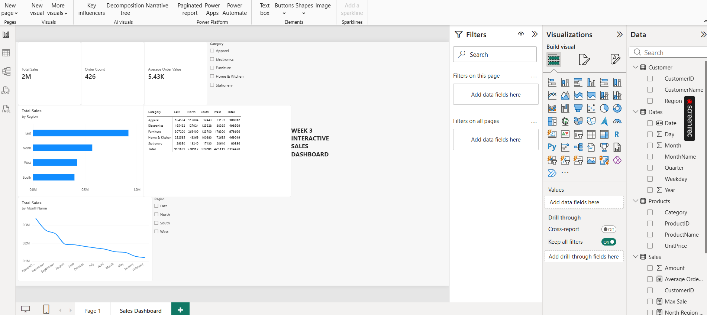

# Week 3 Interactive Sales Dashboard

## Project Overview
Built an interactive one-page dashboard in Power BI to answer key business questions about sales performance.

## Business Questions Answered
1. Which region generates the most revenue?
2. Which product category performs best, and does that vary by region?
3. What is the average order value?

## Tools Used
- Microsoft Power BI
- DAX (Data Analysis Expressions)
- Power Query

## Data Model
- Star Schema
- Fact Table: Sales
- Dimension Tables: Products, Customers, Dates
- 3 Relationships created

## DAX Measures
- Total Sales = SUM(Sales[Amount])
- Order Count = COUNT(Sales[OrderID])
- Average Order Value = AVERAGE(Sales[Amount])
- Max Sale = MAX(Sales[Amount])
- Total Sales YTD = TOTALYTD(SUM(Sales[Amount]), Dates[Date])
- North Region Sales = CALCULATE(SUM(Sales[Amount]), Customer[Region]="North")

## Visuals
- 3 KPI Cards (Total Sales, Order Count, Average Order Value)
- Bar Chart (Sales by Region)
- Line Chart (Sales by Month)
- Matrix (Category × Region)
- Slicers (Region, Category)

## Key Insights
- East region generates the most revenue (919K)
- Furniture is the best-performing category (878K)
- Average Order Value is 5.43K

## Screenshot

## How to Use
1. Download the .pbix file
2. Open in Power BI Desktop
3. Use slicers to filter by Region and Category
